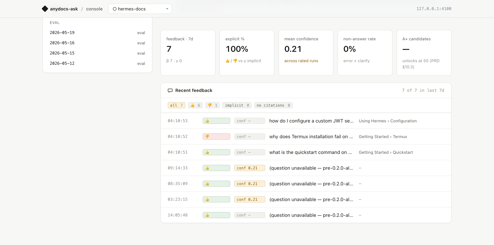
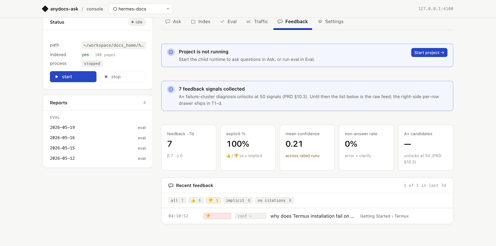
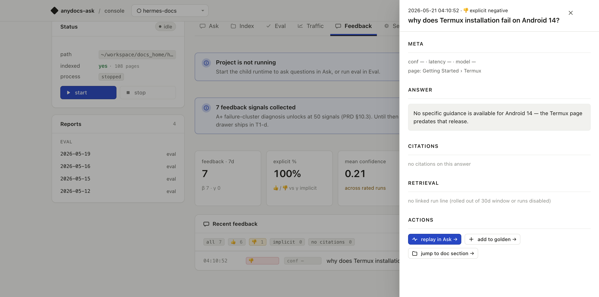
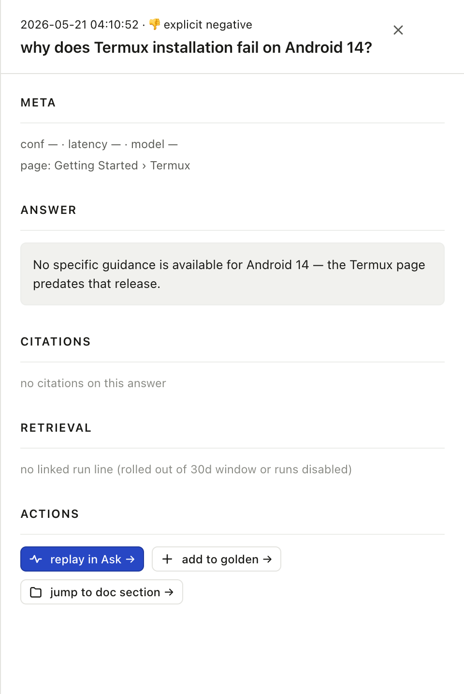
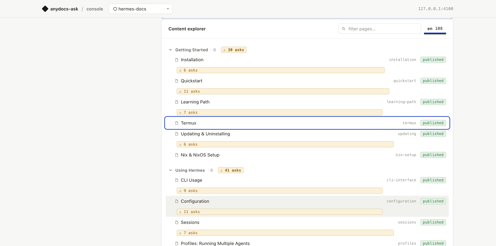
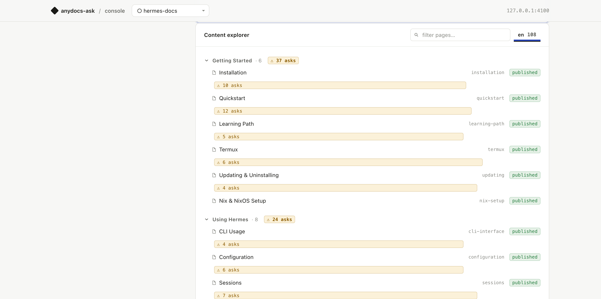

# Journey 6 — Close the feedback loop (walkthrough)

> RFC 0002 reference Journey 6 storyboard, captured against `hermes-docs` on
> 2026-05-21 using the post-T1-tail console (PRs [#46](https://github.com/cregis-dev/anydocs-ask/pull/46) /
> [#47](https://github.com/cregis-dev/anydocs-ask/pull/47) / [#49](https://github.com/cregis-dev/anydocs-ask/pull/49) /
> [#50](https://github.com/cregis-dev/anydocs-ask/pull/50) /
> [#51](https://github.com/cregis-dev/anydocs-ask/pull/51) /
> [#52](https://github.com/cregis-dev/anydocs-ask/pull/52)).
>
> **Use this as a demo script.** Open the console next to this file, follow the steps,
> and the screenshots will match within a few pixels. Each step also lists the
> commit / RFC anchor that shipped the behaviour.

---

## Persona

**"Doc Author Daria"** — opens the console on a Monday morning. Last week's
Reader traffic + 👍/👎 has accumulated. She wants to know:

1. Did `ask` do its job on her docs last week?
2. Which questions didn't get answered well?
3. Which pages are getting hit a lot but answered badly?
4. Can she turn the worst-answered query into a golden case + a doc-edit
   reminder in <60 seconds, without leaving the console?

The Feedback tab → drawer → cross-journey chips → Index reverse marks turn
that into a clickable flow.

---

## Step 0 — set up the demo (one time)

```bash
# Boot console (workspace defaults to ~/anydocs-ask-runtime/)
pnpm dev console --port 4100
```

Open `http://127.0.0.1:4100/p/hermes-docs#feedback`. You need:

- `feedback.enabled = true` in the project's `anydocs.ask.json`
- At least 3 feedback rows in `<workspace>/state/<projectId>/index.db`
  (otherwise the onboarding banner stays up — fine for demos too)
- For the **T4 reverse marks** part, at least one `runs/<YYYY-Www>.jsonl`
  file with answer records hitting various pages

If your workspace doesn't have those yet, run the seed snippets in the
[Appendix](#appendix--seeding-demo-data) at the bottom.

---

## Step 1 — landing on the Feedback tab



What Daria sees first:

- **Top KPI strip** — last 7 days. `7` feedback rows · `100%` explicit (no
  implicit signals yet) · `0.21` mean confidence · `0%` non-answer rate ·
  `A+ candidates: —` (unlocks at 50 per PRD §10.3).
- **Onboarding banner** — "7 feedback signals collected … A+ failure-cluster
  diagnosis unlocks at 50 signals." Auto-hides past 10 rows.
- **List** — newest 50 rows. Per-row: time · 👍/👎/γ badge · `conf X.XX` ·
  question · breadcrumb chain (`Using Hermes › Configuration`). Rows with
  `(question unavailable — pre-0.2.0-alpha.2 row)` are pre-backfill (see
  [#48](https://github.com/cregis-dev/anydocs-ask/pull/48)).

Ships in: [T1-a #46](https://github.com/cregis-dev/anydocs-ask/pull/46) (skeleton + banner) ·
[T1-b #47](https://github.com/cregis-dev/anydocs-ask/pull/47) (KPI + list) ·
[T1-c #49](https://github.com/cregis-dev/anydocs-ask/pull/49) (breadcrumb cell).

---

## Step 2 — chip-filter to the failing row



Daria clicks the `👎 1` chip. The list narrows to the one negative-rated
row in this window — *"why does Termux installation fail on Android 14?"*
pointing at `Getting Started › Termux`. Meta updates to `1 of 1 in last 7d`.

This is a single fetch to `GET /api/projects/:name/feedback?filter=thumbs_down`
— no page reload, drawer state preserved.

Ships in: [T1-b #47](https://github.com/cregis-dev/anydocs-ask/pull/47) (chip endpoint) ·
[T1-c #49](https://github.com/cregis-dev/anydocs-ask/pull/49) added the 5th chip `no citations`.

---

## Step 3 — open the row → drawer



She clicks the row. The right-side detail drawer slides in (mask overlay
behind it) with six sections:

| Section | Content |
|---|---|
| **META** | conf / latency / model + breadcrumb chain |
| **ANSWER** | the markdown answer the user reacted to |
| **CORRECTION** | reviewer's correction text when present |
| **CITATIONS** | per-citation page + quote snippet |
| **RETRIEVAL** | top-8 fused chunks with final/rrf/vec/bm25/nav scores (when the linked run is still in the 30d window) |
| **ACTIONS** | the three cross-journey chips |

ESC, click-outside, and the `×` close button all dismiss.

Ships in: [T1-d #50](https://github.com/cregis-dev/anydocs-ask/pull/50). The
endpoint is `GET /api/projects/:name/feedback/:id`; the drawer JS uses a
request token to guard against stale async responses (Codex P2 caught on
PR #50 review).

---

## Step 4 — the three action chips



The ACTIONS row is where Journey 6 actually closes the loop:

- **replay in Ask →** dispatches the existing `console:reask` CustomEvent
  → fills `#ask-q` textarea and switches to the Ask tab.
- **add to golden →** dispatches `console:add-golden` with
  `{query, context_pageId, citation_pages}` → reuses the BOOTSTRAP_SCRIPT
  handler shipped with [#44](https://github.com/cregis-dev/anydocs-ask/pull/44)
  → POSTs to `/golden/candidate/create-from-run`, toasts, switches to
  Eval tab.
- **jump to doc section →** sets `location.hash = '#index?focus=<pageId>'`.

All three respect the `current_page_id` shape: when the row has no
`current_page_id`, the jump chip degrades to `jump to doc section — n/a`.

Ships in: [T1-d #50](https://github.com/cregis-dev/anydocs-ask/pull/50) (replay-in-Ask) ·
[T1-d follow-up #52](https://github.com/cregis-dev/anydocs-ask/pull/52) (add-to-golden + jump-to-doc + Index focus receiver).

---

## Step 5 — jump to doc section



After clicking `jump to doc section →`:

- URL becomes `/p/hermes-docs#index?focus=termux` (the `?focus=` suffix is
  preserved by `setProjectTab` — see [#53](https://github.com/cregis-dev/anydocs-ask/pull/53)
  for the dogfood-caught regression fix that unblocked this).
- Index tab is now active. The hash-listening `applyFocus()` finds
  `.tree-row[data-page-id="termux"]`, switches lang panel if needed,
  scrolls it to viewport center, and outlines it with the accent color
  for 1.5 s.

Daria now has the Termux page row in front of her — she can read the
existing content and decide whether to add an Android 14 note. The doc
edit itself happens in her IDE / git, not in the console (PRD §11.2 ③
red line — Console never auto-edits `pages/*.json`).

Ships in: [#52](https://github.com/cregis-dev/anydocs-ask/pull/52) (chip + Index focus receiver).

---

## Step 6 — Index reverse marks (T4)



Even without going through Feedback, Daria can browse the Index tab and
spot **which docs need attention** from the reverse marks:

- Per-page: `⚠ N asks` (warn tint when median confidence < 0.5) or
  `◷ N asks` (neutral) — only renders when `N ≥ 3` (PRD-anchored noise
  floor).
- Per-section: the section header gets the aggregate count across all
  descendant pages, same warn/neutral logic.
- Title tooltips read the exact median + count for the hovered node.

The data comes from `runs.jsonl` in the last 7 days, deduped per
(run, page) so multi-chunk hits don't inflate. Median confidence is
"median of medians" at the section level — close-enough for
"is this section healthy?" judgement at a glance.

Ships in: [T4 #51](https://github.com/cregis-dev/anydocs-ask/pull/51).

---

## What Journey 6 does NOT do (red lines)

These are deliberate per PRD §11.2 / RFC 0002 §2.3:

- ❌ Console never writes `pages/*.json` — doc edits happen in author's
  editor + git.
- ❌ Audio QA never enters retrieval — feedback only nudges reranker
  priors (0.3+) + drives "should I write a new page?" hints.
- ❌ Add-to-golden creates a *candidate* in the Pending list — the
  author still has to approve via Eval tab (file + git review, per
  Decision Q5 in RFC 0002 §6).
- ❌ No data leaves the local machine.

---

## What's NOT shipped yet (still on the roadmap)

| Item | Status | Trigger |
|---|---|---|
| A+ failure-cluster grouping in Feedback tab | 0.3 | ≥ 50 explicit feedback rows + ≥ 4 week observation window (PRD §10.3) |
| Semantic-check verdict per citation in drawer | 0.3 | Lands with RFC 0005 |
| Eval ↔ Traffic case-row jump | 0.3 | Workload after T1 — see RFC 0002 D3 |
| Embedded Reader Ask widget | 0.5+ | RFC 0004 |

---

## Appendix — seeding demo data

If your `hermes-docs` (or any other project) hasn't accumulated organic
β/γ feedback yet, paste these into a terminal to populate enough rows
for the storyboard to look identical:

```bash
# 1. Three fresh feedback rows with real questions + current_page_id
sqlite3 ~/anydocs-ask-runtime/state/<project-id>/index.db <<'SQL'
INSERT INTO feedback (answer_id, question, current_page_id, retrieved, generated, rating, signal_source, created_at)
VALUES
  ('demo_1', 'how do I configure a custom JWT secret?', 'configuration',
   '[{"chunk_id":42,"page":"configuration","quote":"JWT secrets are loaded from environment"}]',
   'Set the `HERMES_JWT_SECRET` environment variable before starting the service.',
   1, 'explicit', strftime('%s','now') * 1000),
  ('demo_2', 'why does Termux installation fail on Android 14?', 'termux',
   '[]',
   'No specific guidance is available for Android 14 — the Termux page predates that release.',
   -1, 'explicit', strftime('%s','now') * 1000 - 1000),
  ('demo_3', 'what is the quickstart command on macOS?', 'quickstart',
   '[{"chunk_id":7,"page":"quickstart","quote":"Run brew install hermes"}]',
   '`brew install hermes` then `hermes init`. See Quickstart for details.',
   1, 'explicit', strftime('%s','now') * 1000 - 2000);
SQL

# 2. Synthetic runs.jsonl so Index reverse marks have data to bucket
# Replace `<project-id>` and tweak `pages` array to match your nav.
python3 - <<'PY'
import json, os, time, pathlib
state = pathlib.Path.home() / 'anydocs-ask-runtime' / 'state' / '<project-id>' / 'runs'
state.mkdir(parents=True, exist_ok=True)
year, week = time.gmtime().tm_year, time.strftime('%V', time.gmtime())
out = state / f'{year}-W{week}.jsonl'
def rec(aid, page, conf):
    return {"ts": time.strftime('%Y-%m-%dT%H:%M:%S.000Z', time.gmtime()),
            "request_id": f"req_{aid}", "session_id": None, "query": f"demo for {page}",
            "filters": {}, "context_pageId": None, "source": "reader",
            "retrieval": {"fused": [{"chunk_id": 1, "page": page, "rrf_score": 0.5,
                "final_score": 0.6, "vec_rank": 1, "bm25_rank": 1, "nav_index": 10,
                "nav_index_boost": 0.1}], "subtree_ask_triggered": False},
            "answer": {"kind": "answer", "answer_id": aid, "md": "demo",
                "citations": [{"chunk_id": 1, "page": page, "quote": "..."}],
                "confidence": conf, "latency_ms": 200, "tokens_in": None,
                "tokens_out": None, "model": "mock", "error_code": None},
            "feedback": {"beta": None, "gamma": None}}
records = ([rec(f"warn_{i}", "termux", 0.2 + i*0.05) for i in range(5)] +
           [rec(f"ok_{i}", "quickstart", 0.78 + i*0.02) for i in range(4)])
with out.open('w') as f:
    for r in records:
        f.write(json.dumps(r) + '\n')
print(f"wrote {len(records)} rows to {out}")
PY

# 3. (Cleanup after demo)
# rm <workspace>/state/<project-id>/runs/<year>-W<week>.jsonl
# sqlite3 ~/anydocs-ask-runtime/state/<project-id>/index.db "DELETE FROM feedback WHERE answer_id LIKE 'demo_%';"
```
