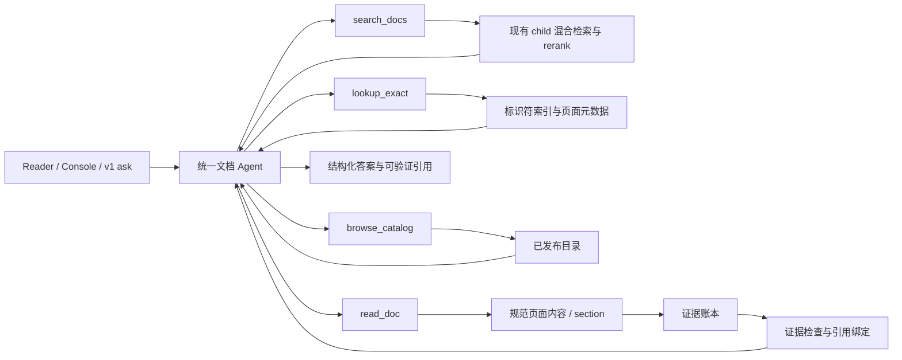

# 文档问答 Agent 化设计方案

> 状态：Proposed；仅设计，尚未实施或发布。日期：2026-09-23。
> 适用范围：`anydocs-ask` 的 Reader / Console 文档问答；以 Cregis 开发者文档作为首个验收项目。
> 核心决策：所有问答请求走同一个 Agent 编排入口，但 Agent 内部允许确定性工具选择；保留现有索引与混合检索，不保留一条独立的旧 RAG 用户路径。

## 1. 要解决的问题

当前系统能较好地找到相关页面，却仍会把关键字段或正确版本的 API 页漏出最终上下文，也会在证据足够时给出冗长或跨产品的回答。Agent 化的目标不是“让模型多调用几次工具”，而是让它在回答前有能力发现并补齐**这个问题所需的决定性证据**，然后只回答这些证据支持的内容。

成功的行为例子：

- 用户问 `/api/v1/payout` 的 MD5 签名原串：定位 WaaS 签名规则，读取排序与拼接示例，给出规则和确切原串；不解释无关的出款状态、`cid` 或费率。
- 用户问 `valid_time`：读取 `/api/v2/checkout` 字段定义和相关错误码；不能因 Quickstart 未提到该字段就声称“文档没有说明”。
- 用户问子地址提现或内部地址：精确找到 `/api/v1/sub_address_withdrawal` 或 `/api/v1/address/inner`，不能以 v2 钱包出款或余额查询替代。
- 用户问交易记录 `fee` 的计算：准确指出文档已定义的字段和未公开的计算规则；不能混入 Payment Engine 的 `settlement_fee`。

本期只回答**已索引的公开/授权文档**。租户配置、API 运行日志、Webhook 原始负载不在当前证据源内；未来如接入，须另行设计授权、脱敏与证据隔离，不能在本方案中假定已具备。

## 2. 现有证据与边界

### 2.1 评测事实

不同日期的实验不是同一基线，不应把数字首尾相接描述为一条连续增益曲线。

| 实验 | 范围与变量 | 观察结果 | 可得结论 |
| --- | --- | --- | --- |
| Parent-Child A/B（2026-09-18） | 92 条 Golden；仅改变命中 child 后的生成上下文；其中 50 条具备语义 reference | Hit@5 均为 0.96，Context-P@5 均为 0.74；Ragas Context Recall 0.636→0.805，Faithfulness 0.856→0.887 | 扩展短 parent 有助于补全上下文；不能证明初始召回或答案事实正确率提高 |
| Reranker 完整 A/B（2026-09-22） | 同一 92 条 Golden hash、索引与回答/Judge 配置；对比基线与 `Xenova/bge-reranker-large` top8、权重 0.6 | Context Precision 0.675→0.730、Context Recall 0.772→0.840（均 n=50）；Faithfulness 0.911→0.910（n=92）；Factual Correctness 0.367→0.352、Rubric 0.845→0.825（均 n=50） | 候选上下文更相关，但单次回答分数未随之改善；不能把后两项下降直接归因于 reranker |
| 逐题人工核对（2026-09-23） | 前 15 条 Factual 回退及 3 条高风险共同失败 | 发现关键页漏召回、回答失焦、跨产品污染、Judge 与人工结论不一致 | 要分离“证据发现/阅读”与“基于证据回答”，并校准 Judge |

2026-09-22 原始结果位于 Cregis 文档仓库本地的 `eval/local-reports/ragas-reranker-ab-20260922/`（该目录未纳入 Git），对应 [基线实验](https://jp.cloud.langfuse.com/project/cmu2a8k6q00rkad0d5ryxpy3n/datasets/cmu6djv1p003had0i1nx61bbt/runs/d5e3b6bd-45f1-418a-a146-d02d8edad5be)和 [reranker 实验](https://jp.cloud.langfuse.com/project/cmu2a8k6q00rkad0d5ryxpy3n/datasets/cmu6djv1p003had0i1nx61bbt/runs/863db57a-58c9-45ec-9ee8-7c9218f31932)。2026-09-18 Parent-Child 报告同样为本地产物；正式实施前应把关键实验元数据（Golden/索引/模型/prompt hash）固定到可复现的实验清单。

注意：当前代码的 reranker 默认是 `enabled: false`；上表的 reranker candidate 是显式开启的实验配置，不等于所有部署环境的当前状态。实施前应记录实际线上配置并用它作对照。

### 2.2 失败类型决定设计

| 类型 | 已观察到的案例 | 需要的系统动作 |
| --- | --- | --- |
| 正确页面没进入上下文 | `sub_address_balance` v1 被 v2 代替；`address/inner`、`sub_address_withdrawal` 漏掉；`valid_time` 只拿到 Quickstart | 精确路径/字段查找；读取权威 API 页；缺事实时补搜 |
| 正确页在，但缺第二份证据 | checkout 金额字段与错误码边界分散在两页 | 把问题拆成原子事实，跨页补齐；对“找不到”做覆盖检查 |
| 证据够，答案却失焦 | collection 的 `from_address` 问题扩展 v2 payout；Webhook `success` 问题扩展签名/支持；`fee` 混入 `settlement_fee` | 最终答案按用户问点压缩；禁止把检索到的邻近 API 当必答内容 |
| 跨域/版本混淆 | Payment Engine 代币错误推荐 WaaS `/api/v1/coins`；v1/v2 出款混用 | 工具层保留产品和版本约束；答案侧检查跨产品引用 |
| 指标与人工判断冲突 | 多题 Rubric 满分但 Factual 明显降分 | 逐题人工复核、重复评测；不能按一次均值调架构 |

因此，单纯继续调大 candidate 数、扩大 parent 或替换 reranker 不是完整解法。Agent 只能解决其中的“按需补证据”部分；回答失焦仍需独立的输出约束和引用校验。

## 3. 架构选择

一个入口，不等于每题都必须走相同数量的 LLM/tool 步骤。明确 API 路径可在同一 Agent 编排器内先走确定性 `lookup_exact`；自然语言从 `search_docs` 起步；只有定位不清时才浏览目录。外部 `/mcp` 继续服务其他客户端，但内部 Agent 调用**进程内 typed service**，不经 HTTP/MCP 自调用，不把现有 `ask()` 包成黑盒工具。现有 `search()` 可以复用其检索核心，但应把“返回一页页可读工具结果”和“保留完整检索 trace”分开设计。

不选“只有目录+页面读取”：自然语言与标题不总是词面匹配，会让模型盲逛目录。不选“旧 RAG 最终答案作为工具”：Agent 看不到缺失事实和候选来源。不引入多 Agent、第二套索引或向量模型迁移。

## 4. 统一入口的执行协议

### 4.1 状态与流程

每次请求维护 `question`、显式 `scope_id`、当前页与安全裁剪后的历史、识别出的产品/版本/路径/字段，以及一份 `required_facts` 和 `evidence_ledger`。`required_facts` 是**问题所需证据槽位**，不是把所有命中的 API 变成回答任务；抽取错误时允许在工具返回后修正。

1. **验证与约束**：保留现有问题长度、发布状态、`scope_id` 严格校验和语言策略。显式 scope 绝不静默扩大为全站。
2. **发现**：有明确 path、operation ID、错误码或字段时先 `lookup_exact`；否则 `search_docs`。两者结果均是候选，不能仅凭标题作答。
3. **阅读**：对最有希望的 1–2 个页面调用 `read_doc`；短页面可取全文，长页面取字段/章节及结构相邻窗口；复用现有 parent 的 3300-token 单块上限与 8000-token 总预算作为初始保护值，实际值经 A/B 调整。
4. **核对**：逐个 `required_fact` 标注 `supported`、`contradicted`、`not_found` 或 `ambiguous`，记录对应 evidence ID。若有决定性缺口，做一次定向补搜/补读。`not_found` 仅表示本轮未找到；只有搜查了相关权威页面/字段后，才能向用户表述“当前文档未说明”。
5. **回答**：只覆盖问点和必要前置条件；事实陈述绑定引用。证据冲突时陈述冲突与适用版本；缺关键证据时承认边界或请求澄清，不靠常识补齐。

所有请求经此编排器，简单问题可只做一次发现和一次阅读，复杂问题可做有限补查。这里的“统一”是**共享状态机、工具层、证据账本与输出校验**，不是强迫简单题多轮搜索。

### 4.2 硬边界与降级

初始预算是待测配置，而不是已验证的最优值：最多 2 次发现调用、2 次阅读调用、1 次定向补查、最多 5 次模型生成步骤；工具执行层另设单请求时间、累计上下文 token、输出 token 和并发上限。并行工具调用也要合计预算，不能只依赖 SDK 的 `stopWhen` 或网关参数。触顶时使用**已经核对过的证据**作简短答复；未覆盖的事实明说未知，绝不回退到无证据的旧 RAG 自由生成。

工具超时、索引不可用、页面版本不一致、模型未调用工具、引用校验失败都有显式状态。可以对瞬时只读错误作一次受控重试；仍失败则返回可观察的部分结果/错误。流式接口只向用户推最终答案和状态，不泄露中间规划文本；在证据校验前不先流出无法撤回的事实断言。

## 5. 工具契约（MVP）

所有工具只读，统一执行发布状态、scope、产品/版本约束；输入用 schema 校验，输出大小受限。`page_id` 与 `section_id` 由索引决定，Agent 不可构造任意文件路径或 SQL。

| 工具 | 输入 | 结构化输出 | 适用场景 |
| --- | --- | --- | --- |
| `search_docs` | query、scope、语言/产品/版本提示、limit | `candidate_id`、page/section、标题/URL、命中 snippet、child/parent ID、分数分解与索引版本 | 模糊自然语言定位；沿用 BM25+向量+精确标识符/RRF+可选 reranker |
| `lookup_exact` | `api_path` / operation ID / field path / error code 之一，scope、产品、版本 | 精确/别名匹配、权威页面 ID、匹配字段或章节、歧义候选 | 解决 `/api/v1/…`、`valid_time`、`A0403` 等决定性定位 |
| `browse_catalog` | 可选产品、文档类型、语言、目录节点、limit | 已发布子树和 page ID/title/路径；不返回正文 | 搜索定位不足或名称歧义时浏览；非每题必调 |
| `read_doc` | page ID；`mode=page/section/field`；可选 section/field ID | 有界原文、内容 hash、语言、标题、URL、章节坐标、截断与剩余 section 信息 | 阅读权威证据；长页按 section/field 下钻 |

`lookup_exact` 不只做字符串包含：路径要区分 v1/v2、产品、方法；字段要能返回对象路径，例如 checkout 请求字段或交易返回的 `data.rows[].fee`；错误码需指出归属页面。优先复用现有 `chunk_identifiers` 和 API 页元数据，再补真实缺失的索引键。`search_docs` 保留 child 召回、同 parent 折叠与候选回填；先量化 page/field 覆盖，不能为了“20 个真实 candidate”盲目扩大检索窗口。

`read_doc` 必须能读取**规范化且完整的页面内容**，不能默认 MCP 当前的 chunk 重建等于权威全文。先验证分块重建的顺序、表格行、代码块、字段对象及锚点没有丢失；不满足时，从索引时的规范内容或持久化 page snapshot 读取。长表格仅按命中字段/错误码附近行返回，避免整表污染上下文。

第一版工具内部可以共用 `SearchService`、`CatalogService` 和 `DocumentReader`；MCP `search/fetch_page` 是这些 service 的外部适配器，保持兼容，不直接承担内部 Agent 的业务状态。

## 6. 证据与引用模型

每份进入回答上下文的内容生成稳定 `evidence_id`，记录 `page_id`、`lang`、`section/field path`、`content_hash`、索引版本、URL、原文范围、检索/精确匹配来源以及是否完整读取。候选 snippet 和目录标题可帮助导航，但**不自动升格为可引用证据**；只有 `read_doc` 返回的原文（或经验证等价的完整 parent）进入证据账本。

最终输出使用机器可校验的 `answer` + `cited_evidence_ids`，再映射到现有 citation 结构。引用验证至少检查：ID 属于本轮账本、页面仍发布且在 scope 内、所引事实与证据片段一致、URL/anchor 指向对应语言和版本。LLM 不能自行编 URL、citation ID 或文档内容。对混合产品/版本的证据设置显式冲突提示，不采用“同名字段即同一语义”的合并。

文档内容和工具返回值一律视为不可信数据，不能当作系统指令；请求、trace 与工具结果继续执行凭证/PII 脱敏。若后续接入私有租户数据，必须先定义租户隔离与引用可见性，不复用公开文档的授权假设。

## 7. 模型与框架

选**单 Agent + 受控工具循环**，首选 AI SDK 的 `ToolLoopAgent`；其多步工具、`stopWhen` 与 `prepareStep` 能覆盖本方案，而执行层仍要自行限制调用和时间。现有 `src/llm/types.ts` 只有文本 `generate/streamGenerate`，不能直接承载工具调用；新增 tool-capable adapter，旧接口保留给其他用途。POC 已用 Anthropic 兼容网关验证 `deepseek-flash` 的工具调用与多步流程，但只覆盖一个真实文档问题，不构成生产质量/延迟证明。[AI SDK 工具循环说明](https://ai-sdk.dev/docs/agents/building-agents)。

POC 验证版本为 `ai@7.0.111`、`@ai-sdk/anthropic@4.0.60`；第一阶段依赖以这些版本做可复现起点，实施前核对锁文件、provider 行为与安全更新。项目当前声明 Node `>=20`，而 POC 环境使用 Node 22；必须先做 Node 20/22 的 CI 与容器兼容矩阵，**不能仅凭 POC 直接升级运行时或发布依赖**。网关的 thinking/tool-choice 兼容性及 `disableParallelToolUse` 表现也要作为集成测试，而非依赖提示词假设。

Langfuse 继续使用仓库已固定的 `@langfuse/client`、`@langfuse/otel`、`@langfuse/tracing@5.11.1`；如采用 AI SDK 原生 telemetry，拟增配相同版本的 `@langfuse/vercel-ai-sdk`，实施前核实 peer dependencies 和实际 trace 树，避免重复上报。优先框架集成捕获模型/usage，业务证据链补手工 observation。[Langfuse AI SDK 集成](https://langfuse.com/docs/observability/get-started)。

## 8. 可观测性与实验

一条用户请求对应一条顶层 trace：记录 release、engine、索引/Golden hash、问题（脱敏后）、scope、产品/版本判定、模型、路由理由、工具调用与预算、每个候选的去留、读取的证据、`required_facts` 状态、最终引用、拒答/澄清原因、token/成本/分段耗时。将 Agent 运行标为 `agent`，检索/读取标为 `retriever`，模型调用标为 `generation`；不要把所有步骤压成一个泛用 `tool` span。[Langfuse observation 类型](https://langfuse.com/docs/observability/features/observation-types)。

继续把实验输出回填 Langfuse Dataset/Experiment，但**离线对照**要固定 92 条 Golden、其中 50 条 reference、索引快照、回答模型、Judge 模型、prompt/tool schema、reranker 配置与随机性。先为基线和 Agent 候选各做多次重复，逐题配对比较；对关键失败题额外人工复核。在线流量用于发现新案例，不直接代替标注后的 Golden。

| 层级 | 指标 | 作用 |
| --- | --- | --- |
| 发现 | 正确 page/field 命中率、v1/v2/product 误命中、首次发现与补查命中 | 判断 `search_docs`、`lookup_exact` 是否找对地方 |
| 读取 | `required_fact` 证据覆盖率、未核实否定陈述率、上下文 token/噪声 | 判断是否真正读到决定性字段，而非只命中同页 |
| 回答 | Ragas Context Precision/Recall、Factual Correctness、Faithfulness、Rubric；引用支持率、跑题/跨产品错误、未知处理 | 区分“证据问题”和“生成问题” |
| 运行 | p50/p95 延迟、LLM/tool 步数、每问 token/成本、超时/预算触顶率 | 判断统一 Agent 路径能否承受生产流量 |

现有 `field-retrieval` 仅覆盖 1 条，不能当作字段级验收依据；`API-rule-pass` 在既有报告中 53 条为 0，须先审计规则/实现再用作发布闸门。Ragas Judge 单次分数与人工结论不一致的题需建立校准样本，不能只按聚合均值升降决定合入。

## 9. 验收集与发布闸门

先把以下案例作为**阻断性回归集**，每题同时要求：决定性证据进入账本、最终回答正确且只引用对应产品/版本、无无关 API 扩写。

| 场景 | 必须出现的证据/行为 |
| --- | --- |
| WaaS v1 子地址余额 | `/api/v1/sub_address_balance` 字段；不可被 v2 余额替换 |
| WaaS 内部地址 | `/api/v1/address/inner` 与 `data.result` 语义 |
| WaaS 子地址提现 | `/api/v1/sub_address_withdrawal`，区别于钱包 payout |
| PE 订单有效期 | `/api/v2/checkout` 的 `valid_time` 与相关边界/状态；缺第二页则继续查 |
| PE 金额范围 | checkout 与金额错误码证据均到位；不能断言“没有范围” |
| WaaS payout MD5 原串 | 鉴权页排序/拼接规则及示例；不扩写出款流程 |
| 交易 `fee` | 正确字段且明确文档未给公式；不混入 `settlement_fee` |
| 产品/版本歧义 | 先澄清或并列标明，不能用另一产品的 API 补空白 |

发布闸门分三级：

1. **确定性**：工具 schema、scope/发布过滤、路径/字段精确匹配、证据 ID 与引用绑定、脱敏和预算测试全部通过；阻断集不得发生跨产品/版本错误或编造 API。
2. **离线 A/B**：相同冻结条件下跑满 92 条，并人工逐题核查阻断集；报告均值、覆盖人数、每题差异和重复试验分布。Context Recall/Precision 与原管线比较不得出现未解释的实质性回退；Factual/faithfulness 不以单次 Judge 小幅波动判定。
3. **影子/灰度**：生产请求先只记录 Agent 候选的脱敏结果、不对用户展示；验证 trace、p95/成本和错误率后逐步切流。量化阈值以影子基线和容量测试设定，不能从一次 3.6–4.6 秒 POC 推断生产 p95。

灰度期间保留旧部署/镜像作为**版本级回滚**，并非在新版本内保留第二条可见问答路径。回滚条件包括权威 API 错答、引用校验失效、超时/成本显著越界或跨租户数据风险。

## 10. 实施顺序与代码边界

| 阶段 | 交付 | 核验 |
| --- | --- | --- |
| 0. 冻结基线 | 固定 Golden/索引/模型/hash，补阻断集的必需 page+field 标签；校准 Judge 与异常规则 | 可重跑旧管线并得到逐题 trace；不改用户路径 |
| 1. 只读证据服务 | 从 `src/query/answer.ts` 解出检索 service；实现精确查找、目录、规范阅读；保留 MCP 适配 | 4 个工具独立单测，短页/长表格/中英/v1-v2/scope 集成测试 |
| 2. Agent 编排 | 新增 `src/agent/` 状态、工具注册、预算、证据账本；接入回答模型 adapter | 工具循环、预算、错误/取消、流式边界、无证据拒答测试 |
| 3. 统一问答入口 | `/v1/ask`、Reader、Console 共用 Agent；输出兼容现有 `AskResult`/citations，MCP `ask` 可复用此入口 | 合同测试、历史/当前页、缓存 key 与 trace schema 回归 |
| 4. A/B 与灰度 | 离线完整实验、人工审题、影子流量、逐步发布和回滚演练 | 达到第 9 节闸门，出可审计报告再放量 |

不要在阶段 1 同时重写 chunking、embedding、reranker 和 Agent：否则无法归因。当前工作树已有未提交的 prompt、reranker、评测修改；实施时应先冻结并记录这些变更，再建立候选基线，不覆盖或顺手重构它们。

## 11. 已知风险与待验证决策

- **页面读取完整性**：当前 MCP `fetch_page` 是从 chunks 重建；需验证是否可直接作权威 page reader，必要时存规范 page snapshot。
- **Agent 成本与延迟**：全流量走同一入口可能增加模型轮次。用工具执行层预算、确定性首步和影子数据衡量，不另设旧 RAG 用户分支。
- **API 路径/版本识别**：需要处理“用户给的是示例路径”与“用户明确指定版本”的差异，避免硬过滤掉正确证据。
- **Judge 可靠性**：部分低分是长答案/指标口径问题，不要为追分引入错误的文档或过度规则。
- **Langfuse 数据安全**：精确记录证据足以复盘，但不能把 API key、日志原文和敏感用户字段写进 trace。
- **依赖兼容**：AI SDK 7/Node 20 声明、Anthropic 兼容网关、OTel/Langfuse 版本组合需在实施前以锁文件和端到端 trace 实测。

本方案的第一项工程工作应是**阶段 0 + 阶段 1 的只读工具垂直切片**，用上述 8 类阻断题证明“找得到且读得全”；之后再接 Agent 循环与回答评测。这样可以明确新收益来自证据发现、证据阅读，还是最终生成，而不是只得到一个难解释的新总分。
